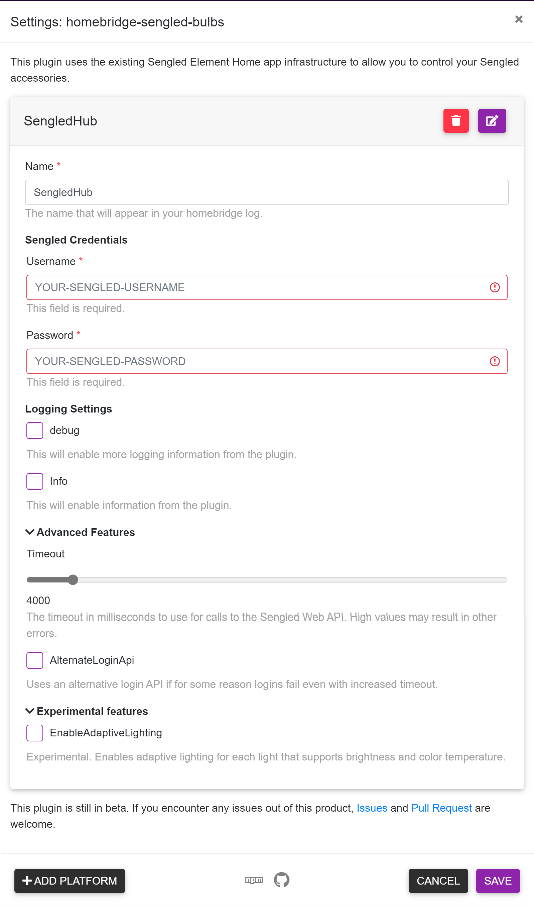

# homebridge-sengled-bulbs (Beta)

An unoffical [Homebridge](https://github.com/nfarina/homebridge) platform plugin for Sengled accessories.

This plugin uses the existing Sengled Element Home app infrastructure to allow you to control your Sengled accessories that uses zigbee. It'll let you turn on/off the lights and control brightness and color temperature using the Home app.

Provide your username and password and register as a platform, and it will auto-detect the light bulb you have registered.

Note that I only have **Element Classic A19 Kit (Light bulbs + Hub)** to test  
https://us.sengled.com/products/element-classic-kit  

This plugin is still in beta.  
If you encounter anything out of this product. Issue and Pull Request is welcome 🙂.

# Installation

1. Install homebridge using: `npm install -g homebridge`
2. Install this plugin using: `npm install -g homebridge-sengled-bulbs`
3. Update your configuration file. See below for a sample.

# Configuration



Configuration sample:

```
"platforms": [
  {
    "platform": "SengledHub",
    "name": "SengledHub",
    "username": "***",
    "password": "***"
  }
]
```

## Optional parameters

- debug, this will enable more logging information from the plugin
- Timeout, The timeout in milliseconds to use for calls to the Sengled Web API. High values may result in other errors.
- AlternateLoginApi, Uses an alternative login API if for some reason logins fail even with increased timeout.
- EnableAdaptiveLighting, Experimental. Enables adaptive lighting for each light that supports brightness and color temperature.
- CustomTemperatureAdjustment, Offsets the color temperature used by adaptive lighting by a fixed amount. Adjust the value larger for warmer light.

```
"platforms": [
  {
    "platform": "SengledHub",
    "name": "SengledHub",
    "username": "***",
    "password": "***",
    "debug": true,
    "Info": false,
    "Timeout": 4000,
    "AlternateLoginApi": true,
    "EnableAdaptiveLighting": true,
    "CustomTemperatureAdjustment": 0
  }
]
```

## Credits

- Inspired by [homebridge-vesync](https://github.com/AlakhaiVaynard/homebridge-vesync) project
